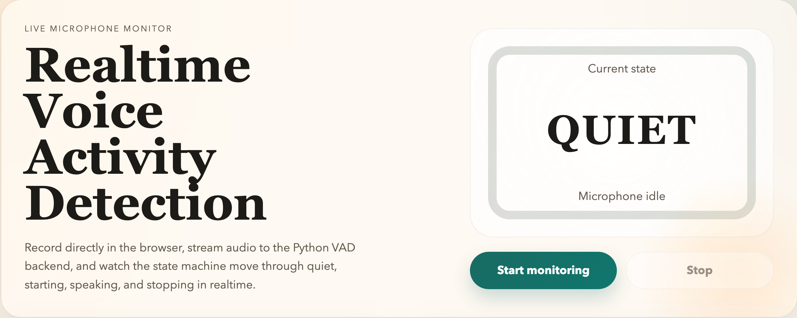
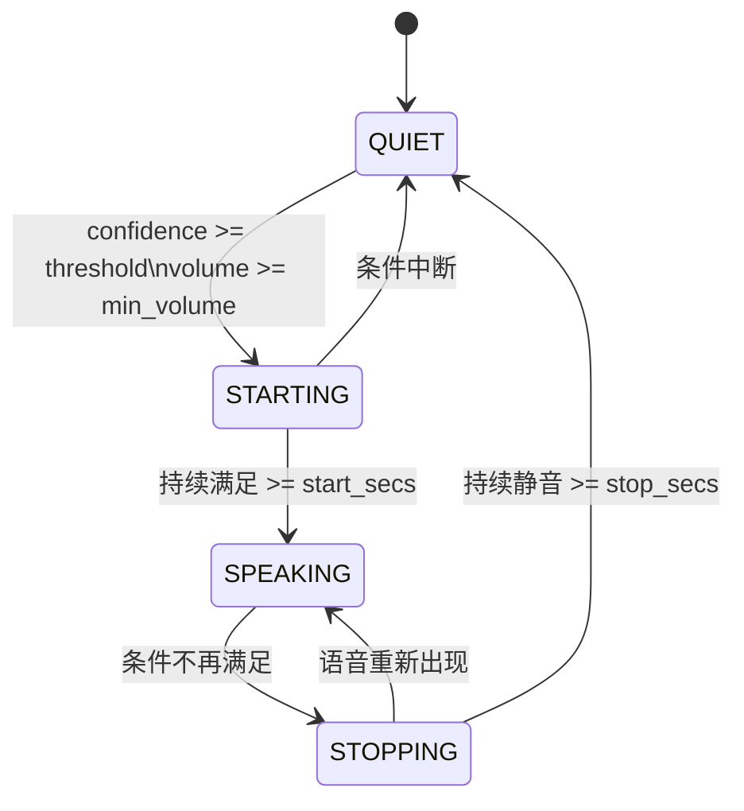

# VAD 原理与本项目实现说明



这个仓库实现了一个基于状态机的 Voice Activity Detection（VAD，语音活动检测）流程，并提供了一个可视化网页用于实时观察状态变化。

它的核心目标不是做语音识别，而是回答一个更基础的问题：

“当前这段音频里，人在不在说话？”

---

## 这个项目可以用来做什么

这个项目不只是一个 VAD demo，它更适合作为一个“理解原理 + 观察效果 + 实际调参”的实验台。

你可以把它用于以下三类目标：

### 1. 理解 VAD 状态机原理和状态转换

如果只看论文、接口文档或者模型输出，通常很难真正建立对 VAD 状态机的直觉。

这个项目把 VAD 拆成了：

- 模型输出的 `confidence`
- 音量门限 `min_volume`
- 四状态状态机 `QUIET / STARTING / SPEAKING / STOPPING`
- 基于 `start_secs / stop_secs` 的滞后确认机制

因此你可以直接观察：

- 为什么不是“一有声音就立刻进入说话态”
- 为什么不是“一安静就立刻判定结束”
- `STARTING` 和 `STOPPING` 这两个中间态是如何消抖的

### 2. 理解 VAD 对对话体验的影响

VAD 调得对不对，直接决定一个实时对话系统“像不像真人在听你说话”。

这个项目非常适合拿来观察以下问题：

- 起说检测太慢时，首字是否被吞掉
- 结束检测太慢时，系统是否拖着不回复
- 阈值太敏感时，背景噪声是否会误触发
- 阈值太保守时，轻声、短句、停顿较多的话语是否容易漏检

换句话说，这个项目可以帮助你把“VAD 参数”与“对话表现”建立直接联系，而不是只停留在抽象概念上。

### 3. 作为 VAD 调参数工具

项目里的网页演示已经提供了一个很实用的调参面板，可以直接在前端修改：

- `confidence threshold`
- `minimum volume`
- `speech start hold`
- `speech stop hold`
- `endpoint strategy`

你可以一边说话、一边看状态变化和 recent transitions，一边快速测试：

- 哪个 sensitivity 更适合你的麦克风和环境
- 哪种 endpointing strategy 更适合实时对话
- 不同参数组合下，系统的响应速度与稳定性如何权衡

在工程里，VAD 常用于以下场景：

- 实时对话系统里判断何时开始收音
- 判断用户什么时候说完一句话，也就是 endpoint detection
- 节省后续 ASR / LLM / TTS 的计算资源
- 把连续音频切成更合理的语音片段

---

## 1. 如何体验这个项目

项目里已经有一个简单的网页演示：

- 后端入口：`web_vad_demo.py`
- 前端页面：`web/index.html`

启动方式：

```bash
cd /Users/wanghuan/Projects/vad
/Users/wanghuan/Projects/vad/.venv/bin/python web_vad_demo.py
```

然后访问：

```text
http://127.0.0.1:8000/
```

页面里可以：

- 打开麦克风
- 实时上传音频块到后端
- 看到当前 VAD 状态
- 观察状态转换历史
- 在前端实时调节 VAD sensitivity 和 endpointing 参数
- 在 `STOPPING -> QUIET` 时看到 endpoint 的高亮效果

如果本地环境里 `Silero VAD` 依赖不可用，演示页会自动退化到一个简单的能量型 VAD，用于保证页面仍然可以运行。

---

## 如何用这个项目调参

推荐把这个页面当成一个“小型 VAD 实验台”来使用，而不是一次性把参数拍脑袋定死。

一个比较实用的调参步骤如下：

### 第一步：先只观察状态，不急着改参数

先用默认参数说几组典型样例：

- 短句
- 连续长句
- 轻声说话
- 带停顿的说话
- 有环境噪声时的说话

重点观察：

- 是否容易从 `QUIET` 进入 `STARTING`
- 是否能稳定进入 `SPEAKING`
- 是否会频繁在 `SPEAKING / STOPPING` 之间抖动
- endpoint 是否过早或过晚

### 第二步：先调 sensitivity，再调 endpointing

建议顺序不要反。

因为如果“有没有检测到语音”本身就不稳定，那么先调结束时机意义不大。

通常可以先调：

- `confidence`
- `min_volume`

等“语音能否稳定被识别”这件事基本合理后，再调：

- `start_secs`
- `stop_secs`

### 第三步：围绕真实对话目标调，而不是围绕单次样例调

不要只拿一句话判断参数好坏，最好围绕你的真实业务目标来测试。

例如：

- 如果你做的是语音助手，更关心响应快不快
- 如果你做的是会议场景，更关心误触发少不少
- 如果你做的是全双工语音对话，更关心中间停顿时是否会误判结束

同一组参数，在不同场景下结论可能完全不同。

### 调参时每个参数怎么看

#### `confidence`

表示模型对“当前帧像不像语音”的置信度门槛。

- 调高：更保守，误触发更少，但轻声和边缘语音更容易漏掉
- 调低：更敏感，更容易起说，但噪声和非语音也更容易触发

#### `min_volume`

表示音量门槛。

- 调高：能过滤掉更轻的背景扰动，但也可能压掉轻声说话
- 调低：更容易接住低音量语音，但环境噪声中更容易抖动

#### `start_secs`

表示要持续满足语音条件多久，才从 `STARTING` 进入 `SPEAKING`。

- 调小：起说更快，首字更不容易丢，但更容易被瞬时噪声触发
- 调大：起说更稳，但开口响应更慢

#### `stop_secs`

表示要持续不满足语音条件多久，才从 `STOPPING` 回到 `QUIET`。

- 调小：endpoint 更快，系统回包更积极，但更容易把自然停顿当成说完
- 调大：结束更稳，不容易截断用户，但系统响应会更慢

### 几类常见现象，对应怎么调

#### 现象 1：系统太容易被噪声触发

可以优先尝试：

- 提高 `confidence`
- 提高 `min_volume`
- 适度增大 `start_secs`

#### 现象 2：系统总是太晚结束，回复拖沓

可以优先尝试：

- 适度减小 `stop_secs`

#### 现象 3：用户开口前半个字容易被吃掉

可以优先尝试：

- 适度减小 `start_secs`
- 必要时略微降低 `confidence`

#### 现象 4：中间短暂停顿就被当成说完

可以优先尝试：

- 适度增大 `stop_secs`

### 一个简单的经验顺序

如果你只是想快速找到“还不错”的参数，建议按这个顺序尝试：

1. 先保持 `start_secs` 和 `stop_secs` 默认
2. 先把 `confidence` 调到“不明显误触发，也不明显漏检”的范围
3. 再用 `min_volume` 适配麦克风和环境噪声
4. 最后用 `start_secs` 和 `stop_secs` 调节对话节奏感

这通常比四个参数一起乱调更高效。

---

## 2. VAD 的基本原理

VAD 的输入通常是一小段连续音频，例如 10ms、20ms、32ms 这样的短帧；输出通常不是文字，而是一个判断：

- 是语音
- 不是语音
- 或者进一步输出一个语音概率

这个项目采用的是两层判断：

1. 先由模型给出“这段音频像不像语音”的置信度 `confidence`
2. 再结合音量 `volume` 与一个状态机，得到最终的 VAD 状态

也就是说，这里不是直接把模型输出当最终结果，而是把它接入一个更稳定的工程化判定流程。

这样做的原因很实际：

- 单帧模型输出容易抖动
- 背景噪声会让概率瞬时升高
- 用户开始说话和结束说话都不是一个采样点就能稳定确认的

所以最终系统要做的是：

- 不只判断“当前帧像不像语音”
- 还要判断“这种趋势持续多久了”

---

## 3. 这个仓库的核心结构

代码主要分成三层：

### 3.1 模型层：`SileroOnnxModel`

文件：`silero_vad.py`

这一层负责真正运行 ONNX 模型。它的工作包括：

- 加载 `silero_vad.onnx`
- 校验输入采样率
- 校验输入帧长度
- 维护模型内部状态 `state`
- 把音频送入 ONNX Runtime，返回模型输出

这一层本质上是“推理执行器”。

它关心的是：

- 模型怎么加载
- 输入张量怎么组织
- 上下文状态怎么保留

它不关心：

- 什么时候算真正开始说话
- 什么时候算真正结束说话
- 页面上应该显示什么状态

---

### 3.2 Analyzer 层：`VADAnalyzer`

文件：`vad_analyzer.py`

`VADAnalyzer` 是这个项目最重要的抽象层。可以把它理解为：

“一个把连续音频流，转换成稳定 VAD 状态的分析器。”

它定义了统一的分析框架，但不绑定具体模型。

它负责：

- 接收输入音频块
- 累积到足够的帧长度
- 调用子类的 `voice_confidence()`
- 计算和过滤音量
- 执行状态机转换
- 返回最终的 `VADState`

它不负责具体模型本身如何推理。那部分由子类实现。

因此，`Analyzer` 可以理解成：

- 上层是音频流输入
- 中间是规则与状态机
- 下层接不同的 VAD 模型

这是一个典型的“算法框架 + 模型插件”设计。

---

### 3.3 具体实现层：`SileroVADAnalyzer`

文件：`silero_vad.py`

`SileroVADAnalyzer` 继承自 `VADAnalyzer`，把抽象方法补齐：

- `num_frames_required()`
- `voice_confidence(buffer)`

也就是说，它把 `VADAnalyzer` 的通用框架和 `Silero VAD` 模型接起来了。

在这个类里：

- `num_frames_required()` 规定每次分析需要多少采样点
  - 16kHz 时为 `512`
  - 8kHz 时为 `256`
- `voice_confidence()` 负责：
  - 把原始 `int16` 音频转成 `float32`
  - 归一化到 `[-1, 1]`
  - 调用 `SileroOnnxModel`
  - 取回模型给出的语音置信度

所以：

- `SileroOnnxModel` 是模型运行器
- `SileroVADAnalyzer` 是把模型接入通用状态机框架的具体 analyzer

---

## 4. “模型是什么，analyzer 是什么”

这是这个仓库里最容易混淆，但又最值得分清的两个概念。

### 模型（model）是什么

模型是一个数学函数或者神经网络。给它一段音频，它返回一个结果，比如：

- 这段更像语音的概率
- 或者某种中间得分

在本项目中，对应的是：

- `SileroOnnxModel`
- 底层模型文件 `silero_vad.onnx`

模型回答的是：

“这一小帧音频像不像语音？”

### Analyzer 是什么

Analyzer 是工程封装。它把模型输出变成一个可用的流式判定器。

在本项目中，对应的是：

- 抽象类 `VADAnalyzer`
- 具体实现 `SileroVADAnalyzer`

Analyzer 回答的是：

“在连续音频流里，现在系统应该处于什么状态？”

换句话说：

- 模型偏向单帧判断
- analyzer 偏向连续流判断

模型输出只是 analyzer 的一个输入，不是最终系统语义。

---

## 5. 本项目里的四种状态

状态定义在 `vad_analyzer.py` 的 `VADState` 中：

- `QUIET`
- `STARTING`
- `SPEAKING`
- `STOPPING`

它们不是简单的“说话 / 不说话”二分类，而是一个带滞后的状态机。

### 5.1 QUIET

表示当前处于静音或非语音状态。

这意味着：

- 最近的音频不满足语音条件
- 或者先前的语音已经完全结束

### 5.2 STARTING

表示系统怀疑“用户开始说话了”，但还没有确认。

这是一个防误判阶段。

如果只因为一帧噪声就立刻进入 `SPEAKING`，系统会很抖。于是这里要求：

- 连续若干帧都满足语音条件
- 达到 `start_secs` 对应的帧数

才真正切换到 `SPEAKING`。

### 5.3 SPEAKING

表示系统已经确认当前正在说话。

这是“稳定的说话中”状态。

### 5.4 STOPPING

表示系统检测到语音似乎结束了，但先不立即回到 `QUIET`。

这是另一个防抖阶段。

如果用户只是：

- 停顿了一下
- 换气了一下
- 中间有一小段低能量

系统不应该立刻认定一句话结束。

所以这里会要求：

- 连续若干帧都不满足语音条件
- 达到 `stop_secs` 对应的帧数

才真正切换回 `QUIET`。

这个 `STOPPING -> QUIET` 的转换，在很多实时语音系统里就可以视为一次 endpoint。

---

## 6. 状态转换机制

下面这张状态图，可以把整个状态机先建立成一个整体印象：



状态转换逻辑在 `VADAnalyzer._run_analyzer()` 中。

先看一次最核心的判定：

```python
speaking = confidence >= self._params.confidence and volume >= self._params.min_volume
```

也就是说，必须同时满足两件事：

- 模型置信度足够高
- 音量也足够高

只有这样，当前帧才被认为是“像在说话”。

### 6.1 从 QUIET 出发

- 如果当前帧满足 `speaking`
  - `QUIET -> STARTING`
  - 并把 `starting_count = 1`

### 6.2 STARTING 阶段

- 如果后续帧持续满足 `speaking`
  - `starting_count += 1`
- 如果中途不满足 `speaking`
  - `STARTING -> QUIET`

当累计帧数达到阈值：

```python
self._vad_starting_count >= self._vad_start_frames
```

则：

- `STARTING -> SPEAKING`

### 6.3 SPEAKING 阶段

- 如果出现不满足 `speaking` 的帧
  - `SPEAKING -> STOPPING`
  - `stopping_count = 1`

### 6.4 STOPPING 阶段

- 如果后续仍然不满足 `speaking`
  - `stopping_count += 1`
- 如果后续重新满足 `speaking`
  - `STOPPING -> SPEAKING`

当累计静音帧达到阈值：

```python
self._vad_stopping_count >= self._vad_stop_frames
```

则：

- `STOPPING -> QUIET`

这就是一句话“真正结束”的判定。

---

## 7. 为什么要用置信度 + 音量双阈值

项目没有只看模型输出，而是同时参考：

- `confidence`
- `volume`

原因是二者解决的问题不同：

### 7.1 置信度解决“像不像语音”

模型擅长区分：

- 人声
- 噪声
- 非语音声音

### 7.2 音量解决“有没有足够的能量”

有些时候模型可能给出一定概率，但实际音频非常轻或者很接近背景噪声。

加入音量门限后，可以滤掉一部分边缘误判。

### 7.3 平滑解决“抖动”

音量不是直接使用的，而是先经过指数平滑：

```python
return exp_smoothing(volume, self._prev_volume, self._smoothing_factor)
```

这让系统对瞬时尖峰不那么敏感，状态会更稳。

---

## 8. 为什么 `analyze_audio()` 是入口方法

对外最重要的入口方法是：

```python
await analyzer.analyze_audio(buffer)
```

这里的 `buffer` 是一小段原始 PCM 音频字节。

这个方法会：

1. 把工作派发到单线程执行器
2. 调用内部 `_run_analyzer()`
3. 维护缓冲区 `_vad_buffer`
4. 在缓冲区足够长时取出一帧做分析
5. 更新状态机
6. 返回当前 `VADState`

所以它返回的不是原始模型分数，而是当前 VAD 状态。

这点非常重要：

- `voice_confidence()` 返回的是模型层面的“语音置信度”
- `analyze_audio()` 返回的是系统层面的“当前状态”

---

## 9. 帧长与采样率要求

这个项目目前支持：

- `8000 Hz`
- `16000 Hz`

在 `SileroVADAnalyzer` 中：

- `16000 Hz` 时每次需要 `512` 帧
- `8000 Hz` 时每次需要 `256` 帧

也就是说，analyzer 并不是来一小块就马上推理，而是会先把数据累积到模型所需大小：

```python
if len(self._vad_buffer) < num_required_bytes:
    return self._vad_state
```

这意味着：

- 如果你送入的 chunk 太小
- 当前调用可能只是在缓存数据
- 状态不会马上变化

---

## 10. 这个实现的工程特点

这个仓库的实现有几个比较典型的工程化特征。

### 10.1 抽象层次清楚

- `SileroOnnxModel` 只做模型推理
- `VADAnalyzer` 只做通用分析框架和状态机
- `SileroVADAnalyzer` 做具体模型接入

这使得以后替换模型很容易，只要新模型也实现：

- `num_frames_required()`
- `voice_confidence()`

就可以复用整个状态机框架。

### 10.2 带滞后的状态机

通过 `STARTING` 与 `STOPPING` 两个中间态，系统不会因为单帧抖动频繁横跳。

### 10.3 模型状态定期重置

`SileroOnnxModel` 是有内部状态的，因此代码里每隔一段时间会 reset：

```python
if diff_time >= _MODEL_RESET_STATES_TIME:
    self._model.reset_states()
```

这是为了避免状态持续积累带来的副作用。

### 10.4 异步入口 + 单线程执行

`analyze_audio()` 是 async，但实际模型运行放在单线程执行器里。这样做的目的通常是：

- 不阻塞主事件循环
- 保证同一个 analyzer 的内部状态按顺序处理

---

## 11. 网页演示里的 fallback analyzer

`web_vad_demo.py` 里额外实现了一个简单的 `EnergyVAD`，它不是主实现，只是演示兜底：

- 如果 Silero 依赖存在，网页后端用 `SileroVADAnalyzer`
- 如果依赖缺失，网页后端退化到 `EnergyVAD`

`EnergyVAD` 的思想更简单：

- 用 RMS 能量估计音量
- 构造一个简化的 `confidence`
- 用与主实现类似的四状态逻辑做转换

它的意义主要是：

- 保证 demo 页面可运行
- 帮助理解状态机本身

它不等同于 Silero 模型的精度。

---

## 12. 一句话总结

如果你希望把这个仓库用于实际实验，可以把它理解成：

- 一个帮助你理解 VAD 状态机原理的示例
- 一个帮助你观察 VAD 如何影响实时对话体验的实验工具
- 一个可以直接在网页上做 sensitivity 和 endpointing 调参的可视化工作台

它的价值，不只在“跑起来”，更在于你可以非常直观地看到：参数一变，状态怎么变；状态一变，对话表现又怎么变。

---

如果只用一句话概括这个项目：

> 它用一个 Silero VAD 模型给出单帧语音置信度，再通过音量门限和四状态状态机，把连续音频流转换成稳定、可用于实时系统的语音活动状态。

再区分一下两个关键概念：

- 模型：负责判断“这一帧像不像语音”
- analyzer：负责判断“当前整个流现在应该处于什么状态”

而四个状态的意义是：

- `QUIET`：静音
- `STARTING`：疑似开始说话，等待确认
- `SPEAKING`：确认正在说话
- `STOPPING`：疑似说完，等待确认结束

其中最关键的 endpoint 通常发生在：

- `STOPPING -> QUIET`

---

## 13. 后续可以继续扩展什么

如果你想继续把这个仓库往实际产品方向推进，比较自然的扩展有：

- 在 README 里补一张状态转换图
- 在网页里同时显示 `confidence` 与 `volume`
- 把 endpoint 时间戳记录下来
- 为不同噪声环境调优 `confidence` / `min_volume` / `start_secs` / `stop_secs`
- 把 `cleanup()` 补完整
- 为 `VADAnalyzer` 增加单元测试，覆盖四种状态转换
